# LOE HUB

<p align="center">
  <strong>A polished monthly Level of Effort platform for workforce planning, reporting, analytics, and operational visibility.</strong>
</p>

<p align="center">
  Built with Laravel, Filament, Livewire, Flux UI, and Fortify.
</p>

<p align="center">
  
  
  
  
  
</p>

---

## Overview

LOE HUB is a two-panel Laravel application for tracking monthly Level of Effort across employees, projects, time off, and spare capacity.

It gives teams a clean operating loop:

- employees log effort in hours,
- the system converts it into days and allocation percentages,
- admins monitor reporting health, utilization, and exceptions,
- reminder jobs keep the process moving,
- and months are locked for reporting integrity after the grace period.

This repository is designed around a practical reporting workflow rather than a generic CRUD demo. The result is a product that supports both operational discipline and decision-making.

---

## Why This Project Exists

LOE HUB helps answer the questions most delivery and operations teams run into every month:

- Who still has reporting outstanding?
- Which employees are overallocated or underallocated?
- How is effort distributed across projects?
- Where is there unused capacity?
- Which assignments are drifting beyond expected allocation?

Instead of keeping that information fragmented across spreadsheets and messages, LOE HUB centralizes it in one application with role-aware access and a consistent monthly lifecycle.

---

## Product Highlights

- Two dedicated Filament panels:
  - `Admin panel` for workforce setup, oversight, analytics, and exports
  - `Employee panel` for self-service reporting, history, and personal analytics
- Monthly LOE reporting in `hours` with calculated `days` and `% allocation`
- Project-based reporting limited to the employee's active assignments
- Manual time-off capture inside the same reporting cycle
- Automatic `Open to New Projects` capacity when total manual allocation stays below `95%`
- Draft, submitted, and closed reporting states
- A `3-day` reporting grace period with reminder automation
- Manual and automatic month closure
- Admin alerting for:
  - underallocation
  - overallocation
  - project allocation above expected threshold
- CSV exports for dashboard summaries, monthly reports, and project allocations
- Authentication with Laravel Fortify, including email verification and two-factor support
- Logged-in employees can update their password from the security settings area
- Pest test coverage for core reporting, access rules, exports, analytics, reminders, and setup flows

---

## Panels

| Panel | URL | Audience | Purpose |
| --- | --- | --- | --- |
| Admin | `/admin` | Admin users | Workforce setup, reporting oversight, analytics, closures, exports |
| Employee | `/employee` | Employee users | Monthly reporting, history, self analytics, profile/security |

Role access is controlled in `User::canAccessPanel()`. The current implementation is role-exclusive:

- `admin` users access the admin panel
- `employee` users access the employee panel
- inactive users cannot access either panel

---

## Core Workflow

```mermaid
flowchart LR
    A["Admin sets up departments, users, projects, and assignments"] --> B["Employee opens current month report"]
    B --> C["Employee enters project hours and time off"]
    C --> D["System calculates days, allocation %, and open capacity"]
    D --> E["Employee saves draft or submits report"]
    E --> F["Admins review reporting health, analytics, and alerts"]
    F --> G["Reminder jobs chase missing reports during month-end and grace period"]
    G --> H["Admin closes month manually or system auto-closes it"]
    H --> I["Closed month becomes locked for stability and auditability"]
```



---

## Employee Flow

### 1. Dashboard

Employees land in a reporting-focused workspace with access to:

- current report status,
- current month signals,
- recent report history,
- remaining open capacity,
- shortcuts into reporting and analytics.

### 2. Current Month Report

The reporting experience supports:

- automatic report creation for the current month,
- previous-month prefill support,
- reporting only against active assigned projects,
- manual time-off entry,
- report notes and line notes,
- real-time estimated totals,
- draft saving,
- submission for admin review.

### 3. History and Detail

Employees can review:

- previous reports,
- status history,
- detailed report views,
- activity trail for their submissions.

### 4. Personal Analytics

Employees can inspect:

- month-over-month effort trends,
- project distribution,
- open-capacity patterns,
- their own reporting behavior over time.

### 5. Account and Security Settings

While logged in, employees can manage their own account settings, including:

- updating their password,
- managing profile details,
- configuring two-factor authentication when enabled.

---

## Admin Flow

### 1. Workforce Setup

Admins manage the master data that powers reporting:

- departments,
- employees,
- projects,
- project assignments,
- public holidays.

### 2. Reporting Oversight

Admins can:

- review submitted and draft reports,
- filter by month, year, department, employee, project, and status,
- inspect report details,
- watch pending compliance,
- manually close months during the grace window.

### 3. Analytics and Visibility

The admin panel includes a command-center style dashboard and dedicated analytics pages for:

- reporting health,
- utilization,
- open capacity,
- pending reports,
- employee-level analysis,
- project-level analysis.

### 4. Exports

Available CSV exports include:

- dashboard summary,
- monthly reports,
- project allocations.

---

## Business Rules

### Reporting model

- One LOE report exists per employee per month.
- Employees enter `hours`.
- The system derives `days` and `% allocation`.
- Each report may include:
  - `project` lines
  - `time_off` lines
  - `open_to_new_projects` lines

### Assignment and project rules

- Employees can report only against their own active assignments.
- Only active projects are eligible.
- Assignment date ranges must overlap the reporting month.

### Capacity rules

- Standard workday = `8 hours`
- Working days exclude:
  - Saturdays
  - Sundays
  - public holidays
- Joining date can prorate the first eligible reporting month

### Open capacity rules

- `Open to New Projects` is not entered manually.
- It is generated only when manual allocation is below `95%`.
- It fills the remaining capacity toward `100%`.

### Submission and alerting rules

- Reports can still be submitted below `100%` or above `100%`.
- Those states trigger admin alerts.
- Project lines above expected assignment percentage also trigger admin alerts.

### Month lifecycle

- Statuses: `draft`, `submitted`, `closed`
- Submitted reports edited before closure return to `draft`
- Reporting month closes after the month end plus a `3-day` grace period
- A locked month cannot be edited

---

## Data Model

Main entities in the application:

- `users`
- `departments`
- `projects`
- `project_assignments`
- `public_holidays`
- `monthly_loe_reports`
- `monthly_loe_report_lines`
- `monthly_loe_closures`
- `monthly_loe_report_activities`
- `notifications`

At a high level:

- a user belongs to a department,
- a user can have many project assignments,
- each monthly report belongs to one user and one department,
- each report has many line items,
- closures lock a reporting month,
- activity logs provide traceability across the report lifecycle.

---

## Tech Stack

| Layer | Technology |
| --- | --- |
| Backend | PHP 8.4, Laravel 13 |
| Admin UI | Filament 5 |
| Reactive UI | Livewire 4 |
| UI Components | Flux UI 2 |
| Authentication | Laravel Fortify |
| Frontend Build | Vite, Tailwind CSS 4 |
| Testing | Pest 4, PHPUnit 12 |
| Database | MySQL |

---

## Local Development Setup

### Requirements

- PHP `8.4`
- Composer
- Node.js + npm
- MySQL

### Installation

```bash
composer install
cp .env.example .env
php artisan key:generate
php artisan migrate
npm install
npm run build
```

If you want the application, queue listener, and Vite dev server together:

```bash
composer run dev
```

The repository also ships with a convenience setup script:

```bash
composer run setup
```

---

## Demo Seed Data

The app includes seed data for a quick local walkthrough:

- Departments:
  - `Engineering`
  - `Experience`
- Projects:
  - `BDC`
  - `LoanEdge`
- Seeded admin:
  - `admin@admin.com`
  - password: `password`
- Seeded employee:
  - `mubashir.akhtar@pixeledge.io`
  - password: `password`

Seed the database with:

```bash
php artisan migrate:fresh --seed
```

---

## Helpful Commands

### Create or promote an admin

```bash
php artisan loe:create-admin admin@example.com --name="Admin User" --password="secret123" --department="Engineering"
```

### Run tests

```bash
php artisan test --compact
```

### Run a focused test file

```bash
php artisan test --compact tests/Feature/Loe/MonthlyLoeReportTest.php
```

### Lint PHP code

```bash
vendor/bin/pint --format agent
```

---

## Scheduled Automation

The application includes three built-in scheduled commands:

| Command | Schedule | Purpose |
| --- | --- | --- |
| `loe:send-reminders` | Daily at `09:00` | Reminds employees in the final three days of the current month |
| `loe:send-overdue-reminders` | Daily at `09:15` | Chases previous-month reports during the grace period |
| `loe:auto-close-months` | Daily at `00:30` | Automatically closes months after the grace deadline |

If you are running this outside local development, remember to configure Laravel's scheduler.

---

## Routing Notes

Convenience routes redirect users into the correct panel experience:

- `/dashboard`
- `/loe/report`
- `/loe/history`
- `/loe/history/{report}`
- `/loe/analytics`

Laravel's health check route is also available at:

- `/up`

---

## Repository Structure

```text
app/
  Console/Commands/          Custom admin + automation commands
  Filament/                  Admin resources, pages, widgets
  Filament/Employee/Pages/   Employee panel pages
  Models/                    Domain models
  Notifications/Loe/         Reminder and alert notifications
  Providers/Filament/        Admin and employee panel providers
  Services/Loe/              Reporting, calculations, closures, exports
database/
  factories/
  migrations/
  seeders/
resources/
  css/
  js/
  views/
tests/
  Feature/
  Unit/
docs/
  loe-technical-document.md
```

---

## What Is Already Covered by Tests

The test suite includes coverage for:

- authentication flows,
- panel access,
- employee reporting rules,
- analytics and CSV exports,
- reminder and auto-close commands,
- workforce setup resources,
- dashboard behavior,
- seeders and admin bootstrap flow,
- core LOE calculation services.

---

## Known Gaps / Future Enhancements

The current implementation intentionally leaves room for future product growth:

- team lead review workflow,
- reviewed intermediary status,
- configurable thresholds via admin settings,
- leaving date support,
- calendar sync for time off,
- dual-panel support for one account acting as both admin and employee.

---

## Project Positioning

LOE HUB is more than a sample admin panel. It is a practical operational application for monthly workforce visibility, blending:

- structured reporting,
- admin observability,
- automation,
- analytics,
- and reporting integrity.

It is a solid foundation for organizations that want a cleaner way to understand allocation, availability, and reporting compliance.
